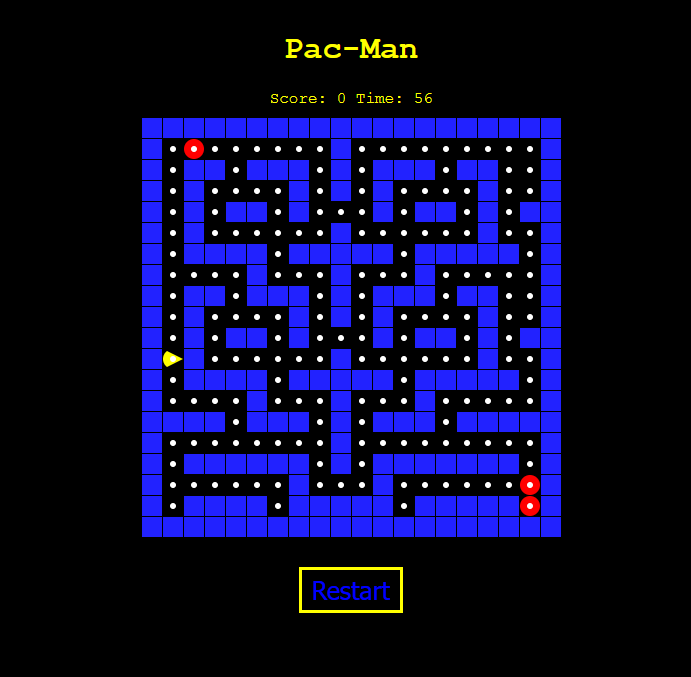

# 🟡 Pac-Man Game (JavaScript)

A simple browser-based **Pac-Man** clone built using **HTML**, **CSS**, and **Vanilla JavaScript**.  
Features animations, ghosts with basic AI, scoring, a timer, and win/lose logic.

---

---

## 🎮 Features

- Classic 2D grid-based map
- Keyboard arrow key movement
- Animated Pac-Man mouth
- Randomly moving ghost
- Score counter (+10 per dot)
- Countdown timer (60 seconds)
- Win when all dots are eaten
- Game Over on ghost collision or timeout

---

## 🚀 How to Run
https://ira4a.github.io/Pacman-Game/
